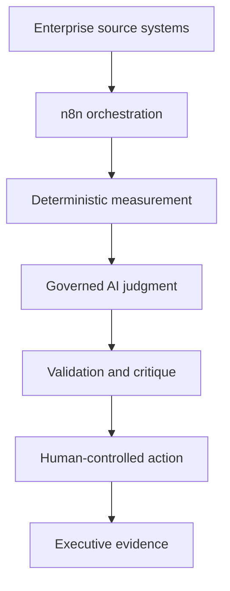

# Viridian Intelligence: Agentic Process Excellence Suite

Enterprise-grade, governed AI automation combining Salesforce administration, Six Sigma measurement, PMP controls, Agile delivery, and n8n orchestration.

This portfolio is built around working, traceable tools rather than decorative AI demonstrations. Each project includes executable workflow automation, sanitized configuration, sample evidence, deterministic calculations, human-control boundaries, security documentation, and an executive-facing output.

## Portfolio projects

| Project | Business problem | Agentic decision | Status |
| --- | --- | --- | --- |
| [01 — Salesforce Governance Sentinel](projects/01-salesforce-governance-sentinel/) | Salesforce automation accumulates governance defects faster than administrators can review it manually | Assesses contextual impact, validates its own output, and routes Critical, Minor, or uncertain findings under human control | **Validated v1.3** |
| 02 — PMP Risk Radar | Salesforce release notes contain noise that is difficult to map to an org's actual customizations | Judges whether a release change creates a real org-specific risk and drafts a RAID response | Planned |
| 03 — Scrum Velocity Intelligence Agent | Sprint metrics often confuse normal variation with recurring delivery-system failures | Detects control-chart signals and unresolved recurring issues across sprints | Planned |

## Project 1 result

The Salesforce Governance Sentinel is a secure n8n workflow that:

- authenticates through OAuth Client Credentials;
- runs as a dedicated Salesforce API-only integration user;
- reads only customer-owned Flow metadata;
- calculates governance defects, DPMO, Sigma, and I-MR limits deterministically;
- uses Gemini for contextual impact judgment and critique;
- validates the AI contract before routing;
- drafts controlled Agile remediation stories;
- routes malformed or uncertain output to human review;
- generates an executive HTML report with run-level traceability.

Validated run:

| Metric | Result |
| --- | --- |
| In-scope Flows | 7 |
| Governance defects | 7 |
| Total opportunities | 21 |
| DPMO | 333,333.33 |
| Sigma level | 1.931 |
| AI critique | VALIDATED |
| Schema contract | PASSED |
| Routing | 7 Minor |

## Design principles

- Foundation before intelligence
- Deterministic measurement before AI judgment
- Least privilege by default
- Human authority over remediation
- Fail safely on malformed AI output
- Explain calculations and limitations
- Never manufacture Six Sigma metrics
- Preserve auditability from source to report

## Suite architecture



## Repository structure

```text
.
├── README.md
├── LICENSE
├── .gitignore
├── docs/
│   └── PORTFOLIO_ROADMAP.md
└── projects/
    ├── 01-salesforce-governance-sentinel/
    ├── 02-pmp-risk-radar/                 # planned
    └── 03-scrum-velocity-intelligence/    # planned
```

## Security

No repository file should contain passwords, API keys, Consumer Secrets, access tokens, customer records, or live credential identifiers. Each project documents its own threat boundaries, revocation mechanisms, and least-privilege controls.

## Current status

- Project 1 engineering: complete and validated
- Project 1 evidence and documentation: complete
- Project 1 video walkthrough: pending owner recording
- Projects 2 and 3: roadmap approved; implementation pending
- Commercial multi-tenant SaaS controls: future phase

## Brand

Viridian Intelligence  
VANTIX Enterprise AI  
`viridianai.in`

