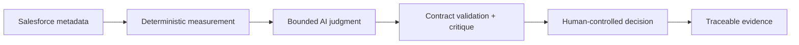

# Viridian Intelligence — VANTIX Enterprise AI Portfolio

[](https://github.com/kalyansrinivas2k26/viridian-agentic-process-excellence-suite/actions/workflows/portfolio-validation.yml)

> **Portfolio Preview.** Governed automation evidence built for transparent technical review. The repositories demonstrate validated portfolio implementations; they do not claim production-scale validation, external certification, or third-party assurance.

**Business outcome:** Turn ambiguous Salesforce and operational signals into evidence-traceable decisions without allowing AI to override deterministic facts or human authority.

**Landed here from a job posting or a recruiter search?** Project 1's [Audience Guide](projects/01-salesforce-governance-sentinel/docs/AUDIENCE_GUIDE.md) routes recruiters, hiring managers, architects, and technical reviewers each to the right file — no need to read everything.

## Portfolio

| Project | Business decision | Public maturity |
|---|---|---|
| [Flow Integrity — Salesforce Governance Sentinel](projects/01-salesforce-governance-sentinel/) | Which Salesforce Flow-governance findings require action, and why? | Portfolio Preview — validated v1.3 evidence package |
| [VANTIX Agile Delivery & Admin Workload Sentinel](https://github.com/kalyansrinivas2k26/vantix-agile-delivery-admin-workload-sentinel) | Is incoming Salesforce work sufficiently evidenced, prioritised and governed to enter delivery? | Portfolio Preview v0.1.1 |
| [VANTIX Control Value](https://github.com/kalyansrinivas2k26/vantix-control-value) | Was a customer commitment sufficiently evidenced to progress toward closure? | Preserved Portfolio Preview lineage |
| [VANTIX Attestor](https://github.com/kalyansrinivas2k26/vantix-attestor) | Can commitment, recovery and customer-momentum decisions be governed through one evidence-gating kernel? | Portfolio Preview v0.1.1 |

Future work is intentionally excluded from this table until a public repository and evidence boundary exist.

## Project 1 — Flow Integrity

Flow Integrity is implemented in [`projects/01-salesforce-governance-sentinel/`](projects/01-salesforce-governance-sentinel/).

Validated v1.3 evidence records:

- Salesforce OAuth 2.0 Client Credentials with a dedicated API-only integration identity.
- Customer-owned Flow metadata only.
- Deterministic governance-defect, opportunity, DPMO, Sigma and I-MR calculations.
- Bounded AI impact assessment and a critique pass.
- Deterministic response-contract validation.
- Human-controlled routing for invalid or uncertain AI output.
- Executive HTML evidence with run-level traceability.

The validated run reported 7 in-scope Flows, 7 declared governance defects across 21 opportunities, DPMO 333,333.33, Sigma 1.931, a VALIDATED AI critique, PASSED schema validation and 7 Minor routes. These figures describe the repository's declared governance-defect model; they are not process-capability certification.

## Control philosophy



1. **Facts before judgment.** AI does not calculate DPMO, Sigma or control limits.
2. **Bounded agency.** AI provides contextual judgment inside an explicit contract.
3. **Fail closed.** Invalid or uncertain output routes to human review.
4. **Least privilege.** The Salesforce integration identity is intentionally restricted.
5. **Evidence before maturity claims.** Portfolio Preview is not production readiness.
6. **Human authority.** Remediation approval remains outside autonomous AI authority.

## Repository structure

```text
.
├── .github/workflows/
│   └── portfolio-validation.yml
├── docs/
│   └── PORTFOLIO_ROADMAP.md
├── projects/
│   └── 01-salesforce-governance-sentinel/
│       ├── README.md
│       ├── PROJECT_STATUS.md
│       ├── SECURITY.md
│       ├── workflows/
│       ├── docs/
│       ├── samples/
│       └── evidence/
├── scripts/
│   └── validate_portfolio.py
├── LICENSE
└── README.md
```

## Evidence boundary

The repository contains sanitized portfolio evidence. It does **not** establish:

- production-scale operation;
- live customer deployment;
- external certification or practitioner approval;
- universal Salesforce governance quality;
- statistical process capability;
- commercial SaaS readiness.

## Release assurance

The repository's automated validation checks documentation controls, required Portfolio Preview artifacts, JSON parseability, banned maturity wording and obvious credential patterns. A green CI run confirms those repository checks passed for the committed revision; it does not substitute for live Salesforce or n8n execution evidence.

## Security

No repository file should contain passwords, API keys, Consumer Secrets, access tokens, customer records or live credential identifiers. Project-specific security boundaries are documented in [`SECURITY.md`](projects/01-salesforce-governance-sentinel/SECURITY.md) and the threat model.

## Review path

- [Project 1 README](projects/01-salesforce-governance-sentinel/README.md)
- [Executive brief](projects/01-salesforce-governance-sentinel/docs/EXECUTIVE_BRIEF.md)
- [Evidence index](projects/01-salesforce-governance-sentinel/docs/EVIDENCE_INDEX.md)
- [Quality scorecard](projects/01-salesforce-governance-sentinel/docs/QUALITY_SCORECARD.md)
- [Security threat model](projects/01-salesforce-governance-sentinel/docs/SECURITY_THREAT_MODEL.md)
- [PMP / PMI AI governance mapping](projects/01-salesforce-governance-sentinel/docs/PMP_AI_GOVERNANCE_MAPPING.md)
- [Final sign-off gates](projects/01-salesforce-governance-sentinel/docs/FINAL_SIGNOFF_GATES.md)

## Brand

**Viridian Intelligence** · **VANTIX Enterprise AI** · `viridianai.in`
