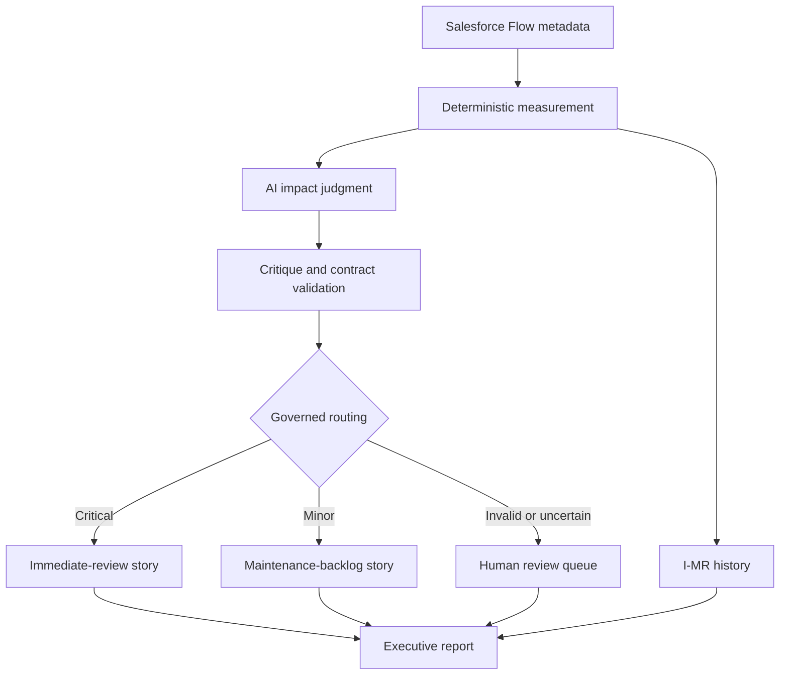

# Salesforce Governance Sentinel

**Viridian Intelligence — Agentic Process Excellence Suite**

Salesforce Governance Sentinel is a governed n8n agent that inspects customer-owned Salesforce Flow metadata, measures governance defects using deterministic Six Sigma calculations, asks AI to assess business impact, validates the AI response, and routes findings into human-controlled remediation paths.

It addresses a practical Salesforce administration problem: undocumented, inactive, or poorly governed automation accumulates faster than administrators can review it manually. Ordinary scanners list metadata. This project converts observations into measurable governance findings, an auditable decision trail, draft Agile remediation stories, statistical history, and an executive report.

## Validated release

Release `v1.3` was executed successfully on 30 July 2026.

| Control | Validated result |
| --- | --- |
| Salesforce authentication | OAuth 2.0 Client Credentials |
| Runtime identity | Dedicated API-only integration user |
| Authorization | Least-privilege permission set |
| Metadata scope | Customer-owned Flows only |
| In-scope Flows | 7 |
| Governance defects | 7 missing descriptions |
| Defect opportunities | 21 |
| DPMO | 333,333.33 |
| Sigma level | 1.931 |
| AI critique | VALIDATED |
| Schema validation | PASSED |
| Routing | 7 Minor, 0 Critical, 0 Human Review |
| Report | Generated successfully |

## What makes it agentic

The AI does more than summarize. It assesses contextual business impact and confidence, while deterministic controls retain authority over measured facts and routing contracts.

1. Salesforce metadata is collected through a restricted API identity.
2. Code calculates defects, opportunities, DPMO, and Sigma.
3. Gemini assesses contextual impact, severity rationale, and confidence.
4. A second AI pass critiques the first assessment.
5. Deterministic code validates structure, IDs, ranges, and completeness.
6. Invalid or uncertain responses route to human review instead of stopping the run.
7. Valid findings route to Critical or Minor treatment and draft governed user stories.
8. Historical scans feed an I-MR control chart.
9. An executive HTML report records the run and its governance limitations.

## Architecture



## Security model

- OAuth Client Credentials; no Salesforce password is stored in workflow nodes.
- Dedicated Salesforce Integration user with the Minimum Access – API Only Integrations profile.
- Salesforce API Integration permission set licence.
- Permission set grants only API access and read-only setup visibility.
- External Client App runs as the dedicated integration user, not an administrator.
- OAuth app is admin-preapproved and bound to the integration permission set.
- SOQL filters `NamespacePrefix = null` to exclude managed-package metadata.
- The workflow reads Flow metadata only; it does not request business-record data.
- Credential values are absent from this repository.

See [Security Model](docs/SECURITY_MODEL.md) for the control design.

## Repository structure

```text
.
├── README.md
├── PROJECT_STATUS.md
├── LICENSE
├── SECURITY.md
├── workflows/
│   └── Salesforce-Governance-Sentinel-v1.3-public.json
├── docs/
│   ├── ARCHITECTURE.md
│   ├── DEPLOYMENT.md
│   ├── METHODOLOGY.md
│   ├── GOVERNANCE_REGISTERS.md
│   ├── RELEASE_NOTES.md
│   ├── TEST_EVIDENCE.md
│   └── DEMO_SCRIPT.md
├── samples/
│   └── validated-run-summary.json
└── evidence/
    ├── executive-report.html
    └── workflow-success.png
```

## Import and configure

1. Import the public workflow JSON into n8n.
2. Replace `YOUR_MY_DOMAIN` in both Salesforce HTTP Request nodes.
3. Create a Salesforce OAuth2 credential using Client Credentials grant.
4. Create a Gemini credential.
5. Create an n8n Data Table named `dpmo_scan_history` with the documented columns.
6. Re-select that table in the Insert Row and Get Scan History nodes.
7. Test the isolated Salesforce connection node.
8. Test the filtered metadata query.
9. Run the complete workflow manually.

Detailed steps and required fields are in [Deployment](docs/DEPLOYMENT.md).

## Interpretation safeguards

- DPMO and Sigma describe declared governance defect opportunities; they are not proof of process capability.
- Cpk is intentionally excluded because customer specification limits do not yet exist.
- AI impact is advisory and can differ from deterministic routing severity.
- AI does not calculate DPMO, Sigma, or control limits.
- AI does not approve implementation, assign story points, or commit work to a sprint.
- Critical remediation and uncertain outputs require human review.

## Current limitation

The v1.3 report shows impact and severity but not the intermediate exposure and priority scores. A High-impact finding can still be Minor when exposure is low. The next presentation revision should display:

```text
Priority score = exposure score × impact score
```

This is a presentation enhancement, not a calculation defect.

## Evidence

- [Validated executive report](evidence/executive-report.html)
- [Successful workflow execution](evidence/workflow-success.png)
- [Test Evidence](docs/TEST_EVIDENCE.md)

## Product status

The workflow engine and security architecture are validated. Public repository publication and video recording are owner actions documented in the demo guide.

See [Project Status](PROJECT_STATUS.md) for the exact distinction between the completed product, owner publication actions, and later commercial SaaS work.
