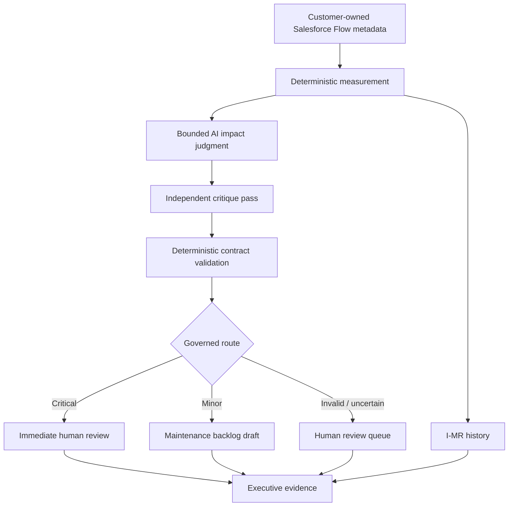

# Flow Integrity — Salesforce Governance Sentinel

> **Portfolio Preview — validated v1.3 evidence package.** Synthetic/sanitized portfolio evidence; no production-scale, external-certification or real-customer-outcome claim is made.

**Business outcome:** Prevent Salesforce automation-governance defects from becoming unaudited operational risk by converting Flow metadata into deterministic measurements, bounded AI judgment and human-controlled remediation evidence.

**New here? Start with [Who's Looking At This — Start Here By Role](docs/AUDIENCE_GUIDE.md)** — nine roles, each with the exact file to open first and what to verify. Recruiter, hiring manager, Salesforce architect, n8n engineer, AI-governance reviewer, Six Sigma reviewer, PMP reviewer, security reviewer, and CEO/business stakeholder are all covered.

## Three validated results

| Control | Repository evidence |
|---|---|
| Deterministic measurement | 7 declared governance defects / 21 declared opportunities; DPMO 333,333.33; Sigma 1.931 |
| AI contract | AI critique `VALIDATED`; schema validation `PASSED` |
| Governed routing | 7 Minor, 0 Critical, 0 Human Review in the validated v1.3 run |

**Real portfolio defect found and corrected:** the public root repository previously presented obsolete future-project names and had no automated repository validation gate. This remediation package replaces the stale portfolio front door and adds deterministic CI checks. This is a repository/release-assurance correction, not a claim that the v1.3 workflow engine failed.

**Known limitation:** the validated evidence is not production-scale and the v1.3 executive report does not display intermediate exposure and priority scores.

**Demo:** owner-recorded 60–90 second video is still pending. Until a real recording is linked here, this requirement remains visibly open rather than being simulated.

**Deep evidence:** [Evidence Index](docs/EVIDENCE_INDEX.md) · [Validated executive report](evidence/executive-report.html) · **Non-technical summary:** [Plain-Language Summary](docs/PLAIN_LANGUAGE_SUMMARY.md)

## The decision this project governs

> **Which Salesforce Flow-governance findings require action, and what evidence supports the route?**

Ordinary metadata inspection can identify configuration states, but it does not by itself provide a controlled decision trail from observation to measurement, contextual judgment, validation, routing and executive evidence. Flow Integrity separates those responsibilities.

## Architecture

### Decision rights

| Decision | Deterministic code | AI | Human |
|---|:---:|:---:|:---:|
| Count defects/opportunities | **Authority** | No | Review |
| Calculate DPMO/Sigma/control limits | **Authority** | No | Review |
| Assess contextual impact | Guardrails | **Advisory** | Override |
| Validate response contract | **Authority** | No | Review |
| Approve remediation | No | No | **Authority** |
| Commit work to a sprint | No | No | **Authority** |

## Evidence-backed release snapshot

Release evidence states that v1.3 executed successfully on **30 July 2026**.

| Measure | Result |
|---|---:|
| In-scope Flows | 7 |
| Declared governance defects | 7 missing descriptions |
| Declared opportunities | 21 |
| DPMO | 333,333.33 |
| Sigma level | 1.931 |
| AI critique | VALIDATED |
| Schema validation | PASSED |
| Routing | 7 Minor |
| Executive report | Generated |

### Six Sigma interpretation boundary

For this portfolio model:

- **Unit:** one in-scope Salesforce Flow.
- **Declared defect:** a governance condition counted by the v1.3 deterministic rule set; the validated run records missing descriptions.
- **Opportunity denominator:** three declared governance opportunities per in-scope Flow in the validated dataset, giving 21 total opportunities for seven Flows.
- **Input dataset:** the sanitized/controlled v1.3 validated run summarized in `samples/validated-run-summary.json` and `docs/TEST_EVIDENCE.md`.
- **Cpk:** intentionally not reported because customer specification limits are not established.

DPMO and Sigma describe this declared governance-defect model. They are not evidence of production process capability.

## Security boundary

- OAuth 2.0 Client Credentials.
- Dedicated Salesforce Integration user.
- API-only access and least-privilege permission set.
- Customer-owned Flow metadata only.
- Managed-package metadata excluded by `NamespacePrefix = null`.
- No business-record retrieval is part of the stated workflow scope.
- Repository credentials are prohibited.
- AI output is advisory and contract-validated before routing.

See [Security Threat Model](docs/SECURITY_THREAT_MODEL.md).

## What this does not prove

This Portfolio Preview does not establish:

- production-scale reliability;
- live-customer deployment;
- production SLOs or operational support;
- external certification or independent practitioner approval;
- statistical process capability;
- superiority over competing commercial products;
- that every Salesforce governance defect class is covered;
- that the current executive report exposes every intermediate priority calculation.

## Executive review path

1. [Executive Brief](docs/EXECUTIVE_BRIEF.md)
2. [Plain-Language Summary](docs/PLAIN_LANGUAGE_SUMMARY.md) — for recruiters/non-technical reviewers
3. [Who's Looking At This — Start Here By Role](docs/AUDIENCE_GUIDE.md) — nine roles, exact file per role
4. [Evidence Index](docs/EVIDENCE_INDEX.md)
5. [Architecture](docs/ARCHITECTURE.md)
6. [Methodology](docs/METHODOLOGY.md)
7. [Security Threat Model](docs/SECURITY_THREAT_MODEL.md)
8. [PMP / PMI AI Governance Mapping](docs/PMP_AI_GOVERNANCE_MAPPING.md)
9. [Agile Traceability](docs/AGILE_TRACEABILITY.md)
10. [Competitive Positioning](docs/COMPETITIVE_POSITIONING.md)
11. [Adversarial Test Catalogue](docs/ADVERSARIAL_TEST_CATALOGUE.md)
12. [Gap Closure Matrix](docs/GAP_CLOSURE_MATRIX.md)
13. [Quality Scorecard](docs/QUALITY_SCORECARD.md)
14. [Final Sign-Off Gates](docs/FINAL_SIGNOFF_GATES.md)
15. [Test Evidence](docs/TEST_EVIDENCE.md)
16. [Release Notes](docs/RELEASE_NOTES.md)
17. [Release Lineage](docs/RELEASE_LINEAGE.md) — reconciles this v1.3 baseline against the retained v1.4.0 audit artifact

## Import and configure

Preserve the existing deployment instructions in `docs/DEPLOYMENT.md`. The public workflow remains `workflows/Salesforce-Governance-Sentinel-v1.3-public.json`.

## Release status

**Engineering evidence:** preserved at v1.3.

**Portfolio maturity:** Portfolio Preview.

**Architecture:** no redesign introduced by this documentation remediation.

**Remaining portfolio-presentation item:** owner-recorded 60–90 second demo link.
