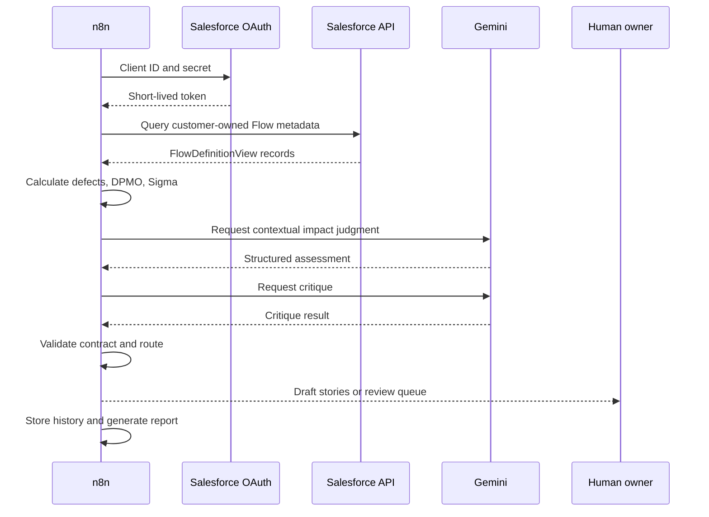

# Architecture

## Design objective

Separate measurement, judgment, validation, action drafting, and approval so that probabilistic AI never controls measured facts or executes remediation.

## Runtime sequence

## Trust boundaries

| Boundary | Control |
| --- | --- |
| n8n to Salesforce | OAuth Client Credentials |
| OAuth app to user | Fixed Run As integration identity |
| User to Salesforce metadata | API-only profile and least-privilege permission set |
| Salesforce packages to customer scope | `NamespacePrefix = null` |
| Measured facts to AI | AI receives facts but cannot rewrite deterministic calculations |
| AI output to routing | Schema and consistency validation |
| Draft remediation to execution | Human approval required |
| Historical data to control chart | n8n Data Table with run correlation ID |

## Components

| Component | Responsibility |
| --- | --- |
| Initialize Run Context | Generates correlation ID and run timestamp |
| Get Flows – REST API | Reads in-scope Flow metadata |
| Calculate DPMO – Flows | Measures defects and Six Sigma indicators |
| Generate Issue Log | Creates deterministic issue records |
| Build Gemini Prompt | Constrains the impact-assessment contract |
| AI Severity Judgment | Provides contextual judgment |
| Merge AI Judgment | Validates and combines judgment with measured findings |
| Build Critique Prompt | Creates independent review request |
| AI Critique | Reviews consistency |
| Merge Critique Results | Applies critique or safe fallback |
| Validate Final Output Schema | Enforces the final data contract |
| Route by Severity | Routes Critical, Minor, and Review Required |
| Story generators | Draft remediation stories without committing work |
| Human Review Queue | Preserves uncertain findings |
| Data Table nodes | Store and retrieve measurement history |
| I-MR calculation | Calculates statistical control limits |
| Executive report | Produces portable decision evidence |

## Scalability

The current query returns one REST page. Before using the workflow in a large org, implement `nextRecordsUrl` pagination, rate-limit handling, execution concurrency limits, and report pagination. The deterministic contract and routing model can remain unchanged.

